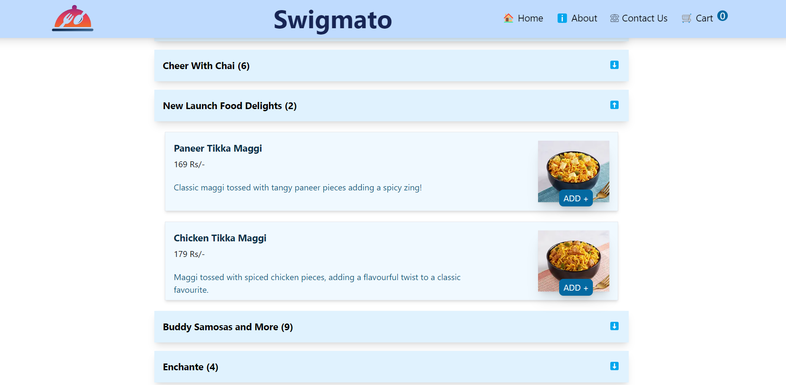

# Swigmato 
 - a food ordering web app that I developed using React.js!

# Key functionalities that I've implemented:
 - Dynamic Filtering based on Rating
 - Restaurant Listing with Menu Options
 - Add to Cart Flow for seamless ordering
 - Routing to Different Pages for smooth navigation
 - Search Restaurant based on Name

# I incorporated various key concepts including :
 - useEffect
 - useState
 - Router
 - Redux Toolkit
 - Controlled components
 - lifting state up
 - Higher Order Component
 - SOLID principles
 - Conditional rendering

 - I used API mock data from Swiggy in project.
 - Throughout this project, I focused exclusively on front-end development, sharpening my skills in React.js and enhancing my understanding of building robust and engaging user interfaces.

